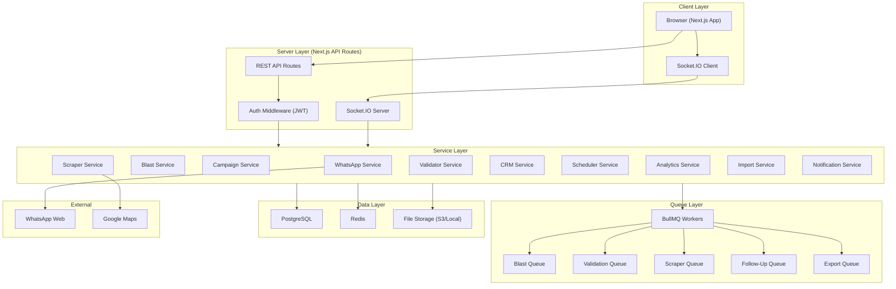
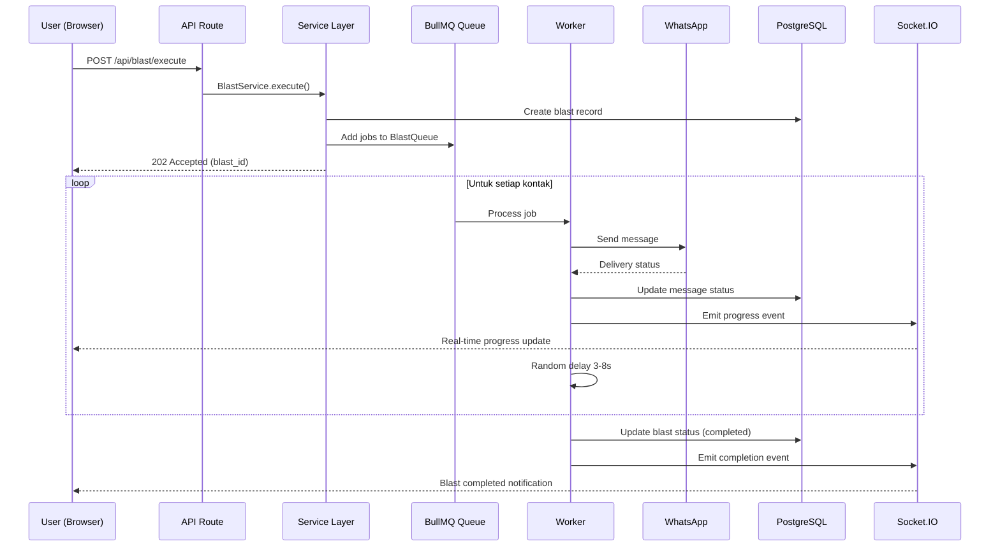
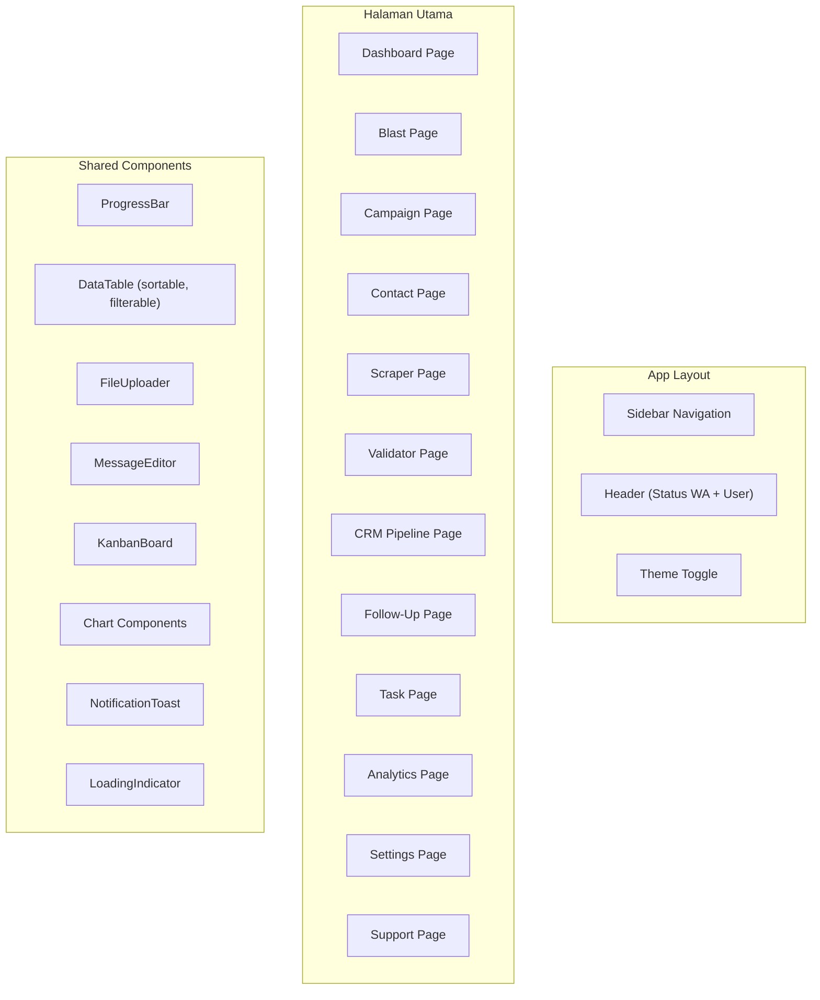
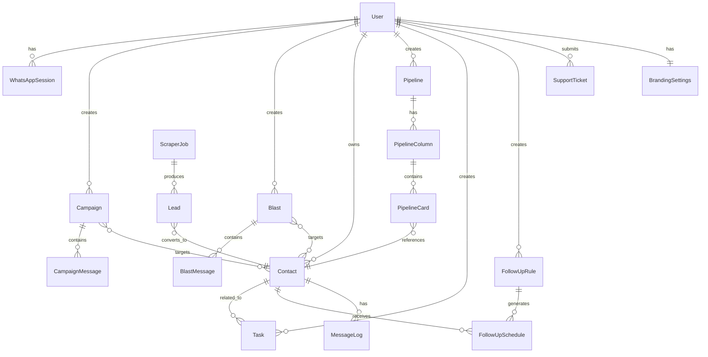
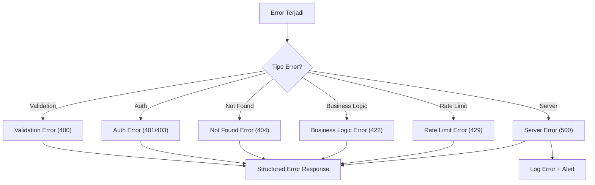
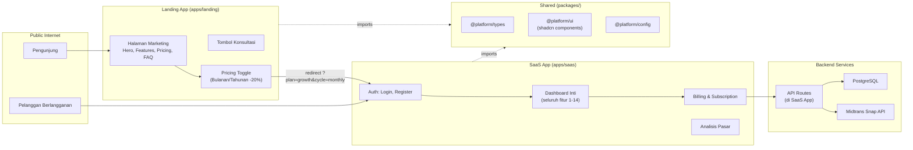
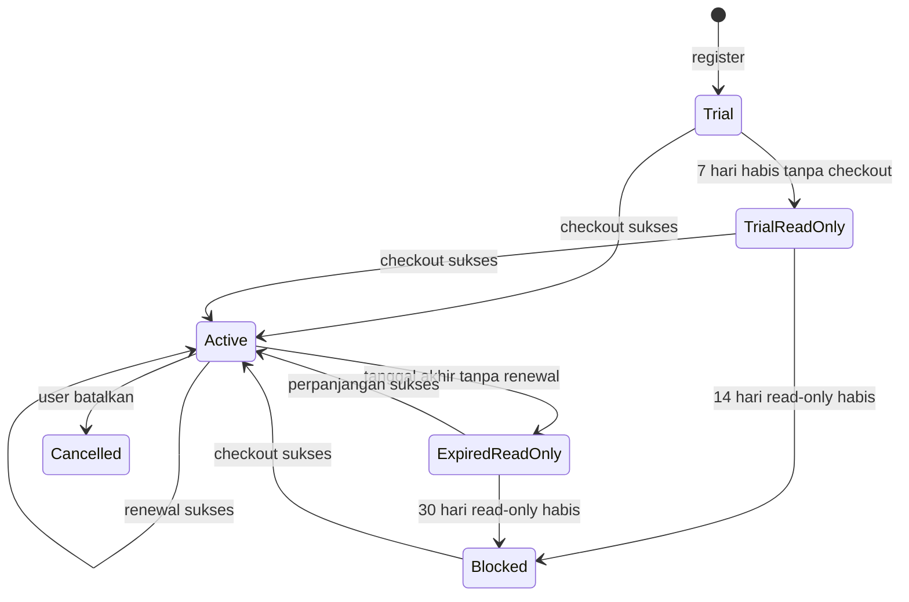
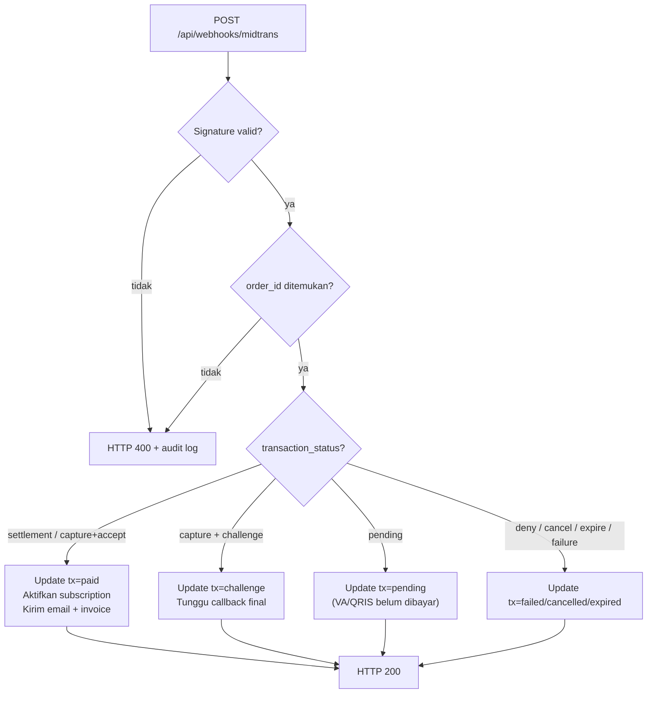

# Dokumen Desain Teknis - WhatsApp Marketing Platform

## Overview

WhatsApp Marketing Platform adalah aplikasi web full-stack yang memungkinkan pengguna mengelola kampanye pemasaran WhatsApp secara komprehensif. Platform ini dibangun dengan arsitektur modern menggunakan **Next.js 14** (App Router) untuk frontend dan backend API, **PostgreSQL** sebagai database utama, **Redis** untuk caching dan job queue, serta **Baileys** (library WhatsApp Web API tidak resmi) untuk koneksi WhatsApp.

### Keputusan Arsitektur Utama

| Keputusan | Pilihan | Alasan |
|-----------|---------|--------|
| Framework | Next.js 14 (App Router) | SSR, API routes terintegrasi, performa optimal |
| Database | PostgreSQL + Prisma ORM | Relational data, ACID compliance, query kompleks |
| Queue System | BullMQ + Redis | Job scheduling, retry mechanism, rate limiting |
| WhatsApp API | Baileys (whatsapp-web.js) | Open-source, multi-device support, tanpa biaya API |
| Real-time | Socket.IO | Bidirectional communication untuk status updates |
| UI Library | Tailwind CSS + shadcn/ui | Konsisten, customizable, dark mode support |
| Auth | JWT + bcrypt | Stateless authentication, secure password hashing |
| File Storage | Local filesystem + S3-compatible | Fleksibel untuk deployment |
| Charts | Recharts | React-native, responsif, customizable |
| Scraping | Puppeteer | Headless browser untuk Google Maps scraping |

## Architecture

### Diagram Arsitektur Sistem



### Pola Arsitektur

1. **Layered Architecture**: Pemisahan jelas antara presentation, business logic, dan data access
2. **Event-Driven**: Menggunakan Socket.IO untuk real-time updates (progress blast, status koneksi)
3. **Queue-Based Processing**: Operasi berat (blast, scraping, validasi) diproses melalui BullMQ workers
4. **Repository Pattern**: Abstraksi akses database melalui Prisma ORM dengan service layer

### Alur Data Utama



## Components and Interfaces

### Struktur Direktori Proyek

```
src/
├── app/                          # Next.js App Router
│   ├── (auth)/                   # Auth layout group
│   │   ├── login/
│   │   └── register/
│   ├── (dashboard)/              # Dashboard layout group
│   │   ├── dashboard/
│   │   ├── blast/
│   │   ├── campaigns/
│   │   ├── contacts/
│   │   ├── scraper/
│   │   ├── validator/
│   │   ├── crm/
│   │   ├── follow-ups/
│   │   ├── tasks/
│   │   ├── analytics/
│   │   ├── settings/
│   │   └── support/
│   ├── api/                      # API Routes
│   │   ├── auth/
│   │   ├── whatsapp/
│   │   ├── blast/
│   │   ├── campaigns/
│   │   ├── contacts/
│   │   ├── scraper/
│   │   ├── validator/
│   │   ├── crm/
│   │   ├── follow-ups/
│   │   ├── tasks/
│   │   ├── analytics/
│   │   ├── settings/
│   │   └── support/
│   └── layout.tsx
├── components/
│   ├── ui/                       # shadcn/ui components
│   ├── dashboard/
│   ├── blast/
│   ├── campaigns/
│   ├── contacts/
│   ├── crm/
│   ├── analytics/
│   └── shared/
├── lib/
│   ├── services/                 # Business logic services
│   ├── queue/                    # BullMQ queue definitions
│   ├── workers/                  # BullMQ workers
│   ├── whatsapp/                 # WhatsApp connection manager
│   ├── scraper/                  # Google Maps scraper
│   ├── validators/               # Input validation schemas
│   ├── utils/                    # Utility functions
│   └── db/                       # Prisma client & migrations
├── hooks/                        # Custom React hooks
├── store/                        # Zustand state management
├── types/                        # TypeScript type definitions
└── config/                       # App configuration
```

### API Endpoints

#### Autentikasi (`/api/auth`)

| Method | Endpoint | Deskripsi |
|--------|----------|-----------|
| POST | `/api/auth/register` | Registrasi pengguna baru |
| POST | `/api/auth/login` | Login dan mendapatkan JWT token |
| POST | `/api/auth/logout` | Logout dan invalidasi token |
| POST | `/api/auth/refresh` | Refresh JWT token |
| PUT | `/api/auth/password` | Ubah password |

#### WhatsApp Connection (`/api/whatsapp`)

| Method | Endpoint | Deskripsi |
|--------|----------|-----------|
| GET | `/api/whatsapp/status` | Status koneksi WhatsApp |
| POST | `/api/whatsapp/connect` | Inisiasi koneksi (generate QR) |
| POST | `/api/whatsapp/disconnect` | Putuskan koneksi |
| GET | `/api/whatsapp/qr` | Dapatkan QR code terbaru |

#### Blast (`/api/blast`)

| Method | Endpoint | Deskripsi |
|--------|----------|-----------|
| GET | `/api/blast` | Daftar semua blast |
| POST | `/api/blast` | Buat blast baru |
| POST | `/api/blast/:id/execute` | Eksekusi blast |
| POST | `/api/blast/:id/stop` | Hentikan blast |
| GET | `/api/blast/:id/progress` | Progress blast |
| GET | `/api/blast/:id/report` | Laporan hasil blast |

#### Campaigns (`/api/campaigns`)

| Method | Endpoint | Deskripsi |
|--------|----------|-----------|
| GET | `/api/campaigns` | Daftar kampanye |
| POST | `/api/campaigns` | Buat kampanye baru |
| PUT | `/api/campaigns/:id` | Update kampanye |
| DELETE | `/api/campaigns/:id` | Hapus kampanye |
| POST | `/api/campaigns/:id/pause` | Jeda kampanye |
| POST | `/api/campaigns/:id/resume` | Lanjutkan kampanye |
| GET | `/api/campaigns/:id/metrics` | Metrik kampanye |

#### Contacts (`/api/contacts`)

| Method | Endpoint | Deskripsi |
|--------|----------|-----------|
| GET | `/api/contacts` | Daftar kontak (paginated) |
| POST | `/api/contacts` | Tambah kontak |
| PUT | `/api/contacts/:id` | Update kontak |
| DELETE | `/api/contacts/:id` | Hapus kontak |
| POST | `/api/contacts/import` | Import dari CSV/Excel |
| GET | `/api/contacts/import/:id/status` | Status import |

#### Scraper (`/api/scraper`)

| Method | Endpoint | Deskripsi |
|--------|----------|-----------|
| POST | `/api/scraper/start` | Mulai scraping |
| POST | `/api/scraper/:id/stop` | Hentikan scraping |
| GET | `/api/scraper/:id/progress` | Progress scraping |
| GET | `/api/scraper/results` | Hasil scraping |

#### Validator (`/api/validator`)

| Method | Endpoint | Deskripsi |
|--------|----------|-----------|
| POST | `/api/validator/start` | Mulai validasi |
| POST | `/api/validator/:id/stop` | Hentikan validasi |
| GET | `/api/validator/:id/progress` | Progress validasi |

#### CRM (`/api/crm`)

| Method | Endpoint | Deskripsi |
|--------|----------|-----------|
| GET | `/api/crm/pipelines` | Daftar pipeline |
| POST | `/api/crm/pipelines` | Buat pipeline |
| PUT | `/api/crm/pipelines/:id` | Update pipeline |
| PUT | `/api/crm/pipelines/:id/columns` | Update kolom |
| PUT | `/api/crm/contacts/:id/move` | Pindahkan kartu |

#### Follow-Ups (`/api/follow-ups`)

| Method | Endpoint | Deskripsi |
|--------|----------|-----------|
| GET | `/api/follow-ups` | Daftar follow-up |
| POST | `/api/follow-ups` | Buat aturan follow-up |
| PUT | `/api/follow-ups/:id` | Update aturan |
| DELETE | `/api/follow-ups/:id` | Hapus aturan |
| POST | `/api/follow-ups/:id/cancel` | Batalkan jadwal |

#### Tasks (`/api/tasks`)

| Method | Endpoint | Deskripsi |
|--------|----------|-----------|
| GET | `/api/tasks` | Daftar task |
| POST | `/api/tasks` | Buat task baru |
| PUT | `/api/tasks/:id` | Update task |
| PUT | `/api/tasks/:id/complete` | Tandai selesai |
| DELETE | `/api/tasks/:id` | Hapus task |

#### Analytics (`/api/analytics`)

| Method | Endpoint | Deskripsi |
|--------|----------|-----------|
| GET | `/api/analytics/dashboard` | Data dashboard |
| GET | `/api/analytics/campaigns` | Perbandingan kampanye |
| GET | `/api/analytics/trends` | Tren pengiriman |
| POST | `/api/analytics/export` | Ekspor laporan |

#### Settings (`/api/settings`)

| Method | Endpoint | Deskripsi |
|--------|----------|-----------|
| GET | `/api/settings/branding` | Pengaturan branding |
| PUT | `/api/settings/branding` | Update branding |
| POST | `/api/settings/branding/logo` | Upload logo |
| PUT | `/api/settings/theme` | Update tema (dark/light) |

#### Support (`/api/support`)

| Method | Endpoint | Deskripsi |
|--------|----------|-----------|
| GET | `/api/support/tickets` | Daftar tiket |
| POST | `/api/support/tickets` | Buat tiket baru |
| GET | `/api/support/faq` | Daftar FAQ |
| GET | `/api/support/docs` | Dokumentasi bantuan |

### Komponen Frontend Utama



### Service Layer Interfaces

```typescript
// WhatsApp Service
interface IWhatsAppService {
  connect(userId: string): Promise<{ qrCode: string; sessionId: string }>;
  disconnect(userId: string): Promise<void>;
  getStatus(userId: string): Promise<ConnectionStatus>;
  sendMessage(sessionId: string, to: string, message: MessagePayload): Promise<SendResult>;
  onStatusChange(callback: (status: ConnectionStatus) => void): void;
}

// Blast Service
interface IBlastService {
  create(userId: string, data: CreateBlastDTO): Promise<Blast>;
  execute(blastId: string): Promise<void>;
  stop(blastId: string): Promise<void>;
  getProgress(blastId: string): Promise<BlastProgress>;
  getReport(blastId: string): Promise<BlastReport>;
}

// Campaign Service
interface ICampaignService {
  create(userId: string, data: CreateCampaignDTO): Promise<Campaign>;
  update(campaignId: string, data: UpdateCampaignDTO): Promise<Campaign>;
  pause(campaignId: string): Promise<void>;
  resume(campaignId: string): Promise<void>;
  getMetrics(campaignId: string): Promise<CampaignMetrics>;
  schedule(campaignId: string, scheduledAt: Date): Promise<void>;
}

// Scraper Service
interface IScraperService {
  start(userId: string, params: ScraperParams): Promise<ScraperJob>;
  stop(jobId: string): Promise<void>;
  getProgress(jobId: string): Promise<ScraperProgress>;
  getResults(jobId: string, filters: ScraperFilters): Promise<Lead[]>;
}

// Validator Service
interface IValidatorService {
  start(userId: string, contactIds: string[]): Promise<ValidationJob>;
  stop(jobId: string): Promise<void>;
  getProgress(jobId: string): Promise<ValidationProgress>;
}

// CRM Service
interface ICRMService {
  createPipeline(userId: string, data: CreatePipelineDTO): Promise<Pipeline>;
  updateColumns(pipelineId: string, columns: PipelineColumn[]): Promise<void>;
  moveContact(contactId: string, targetColumnId: string): Promise<void>;
  getContacts(pipelineId: string, filters: CRMFilters): Promise<PipelineContact[]>;
}

// Scheduler Service (Follow-Up)
interface ISchedulerService {
  createRule(userId: string, data: CreateFollowUpRuleDTO): Promise<FollowUpRule>;
  cancelScheduled(followUpId: string): Promise<void>;
  checkTriggers(): Promise<void>; // Dipanggil setiap 1 jam
  handleIncomingMessage(contactId: string): Promise<void>;
}

// Import Service
interface IImportService {
  validateFile(file: Buffer, filename: string): Promise<ImportPreview>;
  executeImport(userId: string, mapping: ColumnMapping, fileId: string): Promise<ImportResult>;
}

// Analytics Service
interface IAnalyticsService {
  getDashboard(userId: string, period: DateRange): Promise<DashboardData>;
  getCampaignComparison(userId: string, period: DateRange): Promise<CampaignComparison[]>;
  getTrends(userId: string, period: DateRange): Promise<TrendData>;
  exportReport(userId: string, params: ExportParams): Promise<string>; // Returns file URL
}
```


## Data Models

### Diagram Entity-Relationship



### Schema Database (Prisma)

```prisma
// ==================== AUTH & USER ====================

model User {
  id              String   @id @default(cuid())
  email           String   @unique
  passwordHash    String
  name            String
  failedAttempts  Int      @default(0)
  lockedUntil     DateTime?
  createdAt       DateTime @default(now())
  updatedAt       DateTime @updatedAt

  sessions        WhatsAppSession[]
  campaigns       Campaign[]
  blasts          Blast[]
  contacts        Contact[]
  pipelines       Pipeline[]
  tasks           Task[]
  followUpRules   FollowUpRule[]
  tickets         SupportTicket[]
  branding        BrandingSettings?
  preferences     UserPreferences?
}

model UserPreferences {
  id        String @id @default(cuid())
  userId    String @unique
  theme     Theme  @default(LIGHT)
  timezone  String @default("Asia/Jakarta")
  
  user      User   @relation(fields: [userId], references: [id])
}

model InvalidatedToken {
  id        String   @id @default(cuid())
  token     String   @unique
  expiresAt DateTime
  createdAt DateTime @default(now())
}

enum Theme {
  LIGHT
  DARK
}

// ==================== WHATSAPP ====================

model WhatsAppSession {
  id            String           @id @default(cuid())
  userId        String
  status        ConnectionStatus @default(DISCONNECTED)
  sessionData   Json?
  lastConnected DateTime?
  createdAt     DateTime         @default(now())
  updatedAt     DateTime         @updatedAt

  user          User             @relation(fields: [userId], references: [id])
}

enum ConnectionStatus {
  CONNECTED
  DISCONNECTED
  CONNECTING
  RECONNECTING
}

// ==================== CONTACTS ====================

model Contact {
  id              String          @id @default(cuid())
  userId          String
  name            String?
  phone           String
  label           String?
  waStatus        WAStatus        @default(UNKNOWN)
  lastContacted   DateTime?
  createdAt       DateTime        @default(now())
  updatedAt       DateTime        @updatedAt

  user            User            @relation(fields: [userId], references: [id])
  tasks           Task[]
  pipelineCards   PipelineCard[]
  followUpSchedules FollowUpSchedule[]
  messageLogs     MessageLog[]
  blastMessages   BlastMessage[]
  campaignMessages CampaignMessage[]

  @@unique([userId, phone])
  @@index([userId, waStatus])
  @@index([userId, label])
}

enum WAStatus {
  ACTIVE
  INACTIVE
  UNKNOWN
}

// ==================== BLAST ====================

model Blast {
  id              String      @id @default(cuid())
  userId          String
  name            String
  messageText     String?
  messageMedia    Json?       // { type: 'image'|'document', url: string, filename?: string }
  variables       Json?       // Variabel personalisasi
  status          BlastStatus @default(DRAFT)
  totalRecipients Int         @default(0)
  sentCount       Int         @default(0)
  failedCount     Int         @default(0)
  startedAt       DateTime?
  completedAt     DateTime?
  createdAt       DateTime    @default(now())
  updatedAt       DateTime    @updatedAt

  user            User        @relation(fields: [userId], references: [id])
  messages        BlastMessage[]

  @@index([userId, status])
}

model BlastMessage {
  id          String             @id @default(cuid())
  blastId     String
  contactId   String
  status      MessageStatus      @default(PENDING)
  errorReason String?
  sentAt      DateTime?
  createdAt   DateTime           @default(now())

  blast       Blast              @relation(fields: [blastId], references: [id])
  contact     Contact            @relation(fields: [contactId], references: [id])

  @@index([blastId, status])
}

enum BlastStatus {
  DRAFT
  RUNNING
  COMPLETED
  STOPPED
  FAILED
}

enum MessageStatus {
  PENDING
  SENT
  DELIVERED
  READ
  FAILED
}

// ==================== CAMPAIGNS ====================

model Campaign {
  id              String          @id @default(cuid())
  userId          String
  name            String
  description     String?
  messageTemplate String
  messageMedia    Json?
  status          CampaignStatus  @default(DRAFT)
  scheduledAt     DateTime?
  totalRecipients Int             @default(0)
  sentCount       Int             @default(0)
  failedCount     Int             @default(0)
  lastPosition    Int             @default(0)  // Posisi terakhir untuk resume
  startedAt       DateTime?
  completedAt     DateTime?
  createdAt       DateTime        @default(now())
  updatedAt       DateTime        @updatedAt

  user            User            @relation(fields: [userId], references: [id])
  messages        CampaignMessage[]

  @@index([userId, status])
  @@index([scheduledAt])
}

model CampaignMessage {
  id          String        @id @default(cuid())
  campaignId  String
  contactId   String
  status      MessageStatus @default(PENDING)
  deliveredAt DateTime?
  readAt      DateTime?
  repliedAt   DateTime?
  errorReason String?
  sentAt      DateTime?
  createdAt   DateTime      @default(now())

  campaign    Campaign      @relation(fields: [campaignId], references: [id])
  contact     Contact       @relation(fields: [contactId], references: [id])

  @@index([campaignId, status])
}

enum CampaignStatus {
  DRAFT
  SCHEDULED
  ACTIVE
  PAUSED
  COMPLETED
  FAILED
}

// ==================== CRM PIPELINE ====================

model Pipeline {
  id        String           @id @default(cuid())
  userId    String
  name      String
  createdAt DateTime         @default(now())
  updatedAt DateTime         @updatedAt

  user      User             @relation(fields: [userId], references: [id])
  columns   PipelineColumn[]
}

model PipelineColumn {
  id         String         @id @default(cuid())
  pipelineId String
  name       String
  order      Int
  createdAt  DateTime       @default(now())
  updatedAt  DateTime       @updatedAt

  pipeline   Pipeline       @relation(fields: [pipelineId], references: [id])
  cards      PipelineCard[]

  @@index([pipelineId, order])
}

model PipelineCard {
  id         String         @id @default(cuid())
  columnId   String
  contactId  String
  order      Int
  movedAt    DateTime       @default(now())
  createdAt  DateTime       @default(now())
  updatedAt  DateTime       @updatedAt

  column     PipelineColumn @relation(fields: [columnId], references: [id])
  contact    Contact        @relation(fields: [contactId], references: [id])

  @@index([columnId, order])
}

// ==================== FOLLOW-UP & SCHEDULING ====================

model FollowUpRule {
  id              String           @id @default(cuid())
  userId          String
  name            String
  triggerType     TriggerType
  triggerValue    Json             // { days: number } | { stageId: string } | { date: string }
  messageTemplate String
  stepOrder       Int              @default(1)
  maxSteps        Int              @default(1)
  isActive        Boolean          @default(true)
  createdAt       DateTime         @default(now())
  updatedAt       DateTime         @updatedAt

  user            User             @relation(fields: [userId], references: [id])
  schedules       FollowUpSchedule[]

  @@index([userId, isActive])
}

model FollowUpSchedule {
  id              String             @id @default(cuid())
  ruleId          String
  contactId       String
  scheduledAt     DateTime
  status          FollowUpStatus     @default(SCHEDULED)
  retryCount      Int                @default(0)
  errorReason     String?
  sentAt          DateTime?
  createdAt       DateTime           @default(now())
  updatedAt       DateTime           @updatedAt

  rule            FollowUpRule       @relation(fields: [ruleId], references: [id])
  contact         Contact            @relation(fields: [contactId], references: [id])

  @@index([status, scheduledAt])
  @@index([contactId, status])
}

enum TriggerType {
  NO_REPLY_DAYS
  STAGE_CHANGE
  SPECIFIC_DATE
}

enum FollowUpStatus {
  SCHEDULED
  SENT
  FAILED
  CANCELLED
  STOPPED_REPLIED
}

// ==================== TASKS ====================

model Task {
  id          String       @id @default(cuid())
  userId      String
  contactId   String
  title       String
  description String?
  dueDate     DateTime
  priority    Priority     @default(MEDIUM)
  status      TaskStatus   @default(PENDING)
  completedAt DateTime?
  createdAt   DateTime     @default(now())
  updatedAt   DateTime     @updatedAt

  user        User         @relation(fields: [userId], references: [id])
  contact     Contact      @relation(fields: [contactId], references: [id])

  @@index([userId, status, dueDate])
  @@index([contactId])
}

enum Priority {
  HIGH
  MEDIUM
  LOW
}

enum TaskStatus {
  PENDING
  COMPLETED
  OVERDUE
}

// ==================== SCRAPER ====================

model ScraperJob {
  id          String        @id @default(cuid())
  userId      String
  keyword     String
  location    String
  status      ScraperStatus @default(RUNNING)
  totalFound  Int           @default(0)
  duplicates  Int           @default(0)
  createdAt   DateTime      @default(now())
  updatedAt   DateTime      @updatedAt

  leads       Lead[]

  @@index([userId])
}

model Lead {
  id            String     @id @default(cuid())
  scraperJobId  String
  businessName  String
  phone         String?
  address       String?
  rating        Float?
  category      String?
  reviewCount   Int?
  contactId     String?    // Jika sudah dikonversi ke Contact
  createdAt     DateTime   @default(now())

  scraperJob    ScraperJob @relation(fields: [scraperJobId], references: [id])
  contact       Contact?   @relation(fields: [contactId], references: [id])

  @@index([scraperJobId])
  @@index([category])
  @@index([rating])
}

enum ScraperStatus {
  RUNNING
  COMPLETED
  FAILED
  STOPPED
}

// ==================== BRANDING ====================

model BrandingSettings {
  id             String   @id @default(cuid())
  userId         String   @unique
  appName        String   @default("WhatsApp Marketing Platform")
  logoUrl        String?
  faviconUrl     String?
  primaryColor   String   @default("#2563eb")
  secondaryColor String   @default("#7c3aed")
  createdAt      DateTime @default(now())
  updatedAt      DateTime @updatedAt

  user           User     @relation(fields: [userId], references: [id])
}

// ==================== SUPPORT ====================

model SupportTicket {
  id          String       @id @default(cuid())
  userId      String
  ticketNo    String       @unique
  subject     String
  message     String
  status      TicketStatus @default(OPEN)
  createdAt   DateTime     @default(now())
  updatedAt   DateTime     @updatedAt

  user        User         @relation(fields: [userId], references: [id])
}

enum TicketStatus {
  OPEN
  IN_PROGRESS
  RESOLVED
}

// ==================== MESSAGE LOG ====================

model MessageLog {
  id          String    @id @default(cuid())
  contactId   String
  direction   Direction
  content     String
  mediaUrl    String?
  status      MessageStatus @default(SENT)
  createdAt   DateTime  @default(now())

  contact     Contact   @relation(fields: [contactId], references: [id])

  @@index([contactId, createdAt])
}

enum Direction {
  INBOUND
  OUTBOUND
}
```

### DTOs dan Validation Schemas (Zod)

```typescript
import { z } from 'zod';

// Auth
export const RegisterSchema = z.object({
  email: z.string().email(),
  password: z.string()
    .min(8)
    .regex(/[A-Z]/, 'Minimal 1 huruf besar')
    .regex(/[a-z]/, 'Minimal 1 huruf kecil')
    .regex(/[0-9]/, 'Minimal 1 angka'),
  name: z.string().min(1).max(100),
});

export const LoginSchema = z.object({
  email: z.string().email(),
  password: z.string().min(1),
});

// Blast
export const CreateBlastSchema = z.object({
  name: z.string().min(1).max(100),
  messageText: z.string().max(4096).optional(),
  contactIds: z.array(z.string()).min(1).max(10000),
  variables: z.record(z.string()).optional(),
});

// Campaign
export const CreateCampaignSchema = z.object({
  name: z.string().min(1).max(100),
  description: z.string().max(500).optional(),
  messageTemplate: z.string().min(1).max(4096),
  contactIds: z.array(z.string()).min(1).max(10000),
  scheduledAt: z.string().datetime().optional(),
});

// Contact
export const ContactSchema = z.object({
  name: z.string().max(100).optional(),
  phone: z.string().regex(/^\+?\d{8,15}$/),
  label: z.string().max(50).optional(),
});

// Task
export const CreateTaskSchema = z.object({
  title: z.string().min(1).max(100),
  description: z.string().max(500).optional(),
  contactId: z.string(),
  dueDate: z.string().datetime(),
  priority: z.enum(['HIGH', 'MEDIUM', 'LOW']).default('MEDIUM'),
});

// Follow-Up Rule
export const CreateFollowUpRuleSchema = z.object({
  name: z.string().min(1).max(100),
  triggerType: z.enum(['NO_REPLY_DAYS', 'STAGE_CHANGE', 'SPECIFIC_DATE']),
  triggerValue: z.object({
    days: z.number().min(1).max(90).optional(),
    stageId: z.string().optional(),
    date: z.string().datetime().optional(),
  }),
  messageTemplate: z.string().min(1).max(4096),
  stepOrder: z.number().min(1).max(10),
});

// Scraper
export const ScraperParamsSchema = z.object({
  keyword: z.string().min(1).max(200),
  location: z.string().min(1).max(200),
  maxResults: z.number().min(1).max(500).default(100),
  filters: z.object({
    minRating: z.number().min(1).max(5).optional(),
    category: z.string().optional(),
    subDistrict: z.string().optional(),
  }).optional(),
});

// Branding
export const BrandingSchema = z.object({
  appName: z.string().max(50).optional(),
  primaryColor: z.string().regex(/^#[0-9a-fA-F]{6}$/).optional(),
  secondaryColor: z.string().regex(/^#[0-9a-fA-F]{6}$/).optional(),
});

// Support Ticket
export const CreateTicketSchema = z.object({
  subject: z.string().min(1).max(200),
  message: z.string().min(1).max(2000),
});

// Password validation
export const PasswordSchema = z.string()
  .min(8, 'Minimal 8 karakter')
  .regex(/[A-Z]/, 'Minimal 1 huruf besar')
  .regex(/[a-z]/, 'Minimal 1 huruf kecil')
  .regex(/[0-9]/, 'Minimal 1 angka');

// Phone validation
export const PhoneSchema = z.string().regex(/^\+?\d{8,15}$/, 'Format nomor telepon tidak valid (8-15 digit)');
```


## Correctness Properties

*Sebuah property adalah karakteristik atau perilaku yang harus berlaku benar di seluruh eksekusi valid dari sebuah sistem — pada dasarnya, pernyataan formal tentang apa yang seharusnya dilakukan sistem. Properties berfungsi sebagai jembatan antara spesifikasi yang dapat dibaca manusia dan jaminan kebenaran yang dapat diverifikasi mesin.*

### Property 1: Validasi Payload Pesan Blast

*For any* payload pesan blast, jika teks memiliki panjang <= 4096 karakter, gambar berukuran <= 5MB dengan format JPG/PNG, dan dokumen berukuran <= 10MB dengan format PDF/DOC/XLSX, maka validasi harus menerima payload tersebut. Sebaliknya, jika salah satu batasan dilanggar, validasi harus menolak payload.

**Validates: Requirements 2.1**

### Property 2: Estimasi Waktu Pengiriman Blast

*For any* jumlah penerima N (1 <= N <= 10000), estimasi waktu pengiriman harus sama dengan N * rata-rata jeda (5.5 detik) dengan toleransi yang proporsional terhadap range jeda (3-8 detik), sehingga estimasi minimum = N * 3 dan estimasi maksimum = N * 8.

**Validates: Requirements 2.2**

### Property 3: Jeda Antar Pesan Blast Dalam Rentang Valid

*For any* jeda yang dihasilkan oleh sistem blast, nilai jeda harus selalu berada dalam rentang 3 hingga 8 detik (inklusif).

**Validates: Requirements 2.4**

### Property 4: Invariant Jumlah Pesan Blast

*For any* blast dalam status apapun (berjalan, selesai, atau dihentikan), jumlah pesan terkirim + jumlah pesan gagal + jumlah pesan tersisa harus selalu sama dengan total penerima.

**Validates: Requirements 2.5, 2.8**

### Property 5: Validasi Form Kampanye

*For any* data pembuatan kampanye, jika nama memiliki panjang 1-100 karakter, daftar penerima memiliki 1-10000 item, dan template pesan tidak kosong, maka validasi harus menerima data tersebut. Jika salah satu field wajib kosong atau melebihi batas, validasi harus menolak.

**Validates: Requirements 3.2, 3.3**

### Property 6: Kalkulasi Rate Metrik Kampanye

*For any* kampanye dengan jumlah pesan terkirim > 0, delivery rate harus sama dengan (delivered / sent * 100), read rate harus sama dengan (read / delivered * 100), dan reply rate harus sama dengan (replied / sent * 100), dengan semua nilai berada dalam rentang 0-100%.

**Validates: Requirements 3.6**

### Property 7: Resume Kampanye Dari Posisi Terakhir

*For any* kampanye yang dijeda pada posisi P, ketika dilanjutkan, pesan berikutnya yang dikirim harus dimulai dari posisi P+1 tanpa ada pesan yang dilewati atau diduplikasi.

**Validates: Requirements 3.8**

### Property 8: Filter Periode Waktu Analytics

*For any* rentang tanggal yang dipilih dan kumpulan data pesan, semua data yang dikembalikan oleh filter harus memiliki timestamp yang berada dalam rentang tanggal tersebut (inklusif).

**Validates: Requirements 4.2**

### Property 9: Definisi Kontak Aktif

*For any* kumpulan kontak dan log pesan, kontak yang dihitung sebagai "aktif" harus memiliki minimal satu pesan (masuk atau keluar) dalam 30 hari terakhir dari tanggal referensi.

**Validates: Requirements 4.1**

### Property 10: Pengurutan Tabel Perbandingan Kampanye

*For any* daftar kampanye dan kolom pengurutan yang dipilih, hasil yang dikembalikan harus terurut secara benar (ascending atau descending) berdasarkan nilai kolom tersebut.

**Validates: Requirements 4.5**

### Property 11: Validasi dan Identifikasi Baris Import CSV

*For any* file CSV dengan campuran baris valid dan invalid, setiap baris dengan nomor telepon yang cocok dengan pola `^\+?\d{8,15}$` harus diterima, dan setiap baris yang tidak cocok harus ditolak dengan mencatat nomor baris dan alasan penolakan yang benar.

**Validates: Requirements 5.3, 5.4**

### Property 12: Invariant Jumlah Import

*For any* hasil import, jumlah berhasil diimpor + jumlah duplikat dilewati + jumlah error harus selalu sama dengan total baris yang diproses.

**Validates: Requirements 5.5**

### Property 13: Preview Import Maksimal 10 Baris

*For any* file CSV/Excel yang valid dengan N baris data (N >= 1), preview yang ditampilkan harus berisi tepat min(N, 10) baris.

**Validates: Requirements 5.1**

### Property 14: Filter Hasil Scraper

*For any* kumpulan data lead dan kombinasi filter (lokasi, rating minimum, kategori), semua hasil yang dikembalikan harus memenuhi SEMUA kriteria filter yang diterapkan secara simultan: lokasi cocok dengan kelurahan yang dipilih, rating >= nilai minimum, dan kategori cocok dengan yang dipilih.

**Validates: Requirements 6.3, 6.4, 6.5**

### Property 15: Invariant Jumlah Scraper

*For any* hasil scraping, jumlah data unik yang disimpan + jumlah duplikat yang dilewati harus sama dengan total data yang ditemukan.

**Validates: Requirements 6.6**

### Property 16: Status Validasi Nomor WhatsApp

*For any* nomor yang telah divalidasi, statusnya harus tepat salah satu dari: "Aktif WA", "Tidak Aktif WA", atau "Tidak Dapat Diverifikasi" — tidak boleh ada status lain atau status kosong.

**Validates: Requirements 7.2**

### Property 17: Invariant Jumlah Validasi

*For any* hasil validasi (baik selesai maupun dibatalkan), jumlah aktif + jumlah tidak aktif + jumlah tidak dapat diverifikasi harus sama dengan total nomor yang sudah diproses.

**Validates: Requirements 7.5**

### Property 18: Jeda Antar Pengecekan Validasi Dalam Rentang Valid

*For any* jeda yang dihasilkan oleh validator, nilai jeda harus selalu berada dalam rentang 2 hingga 5 detik (inklusif).

**Validates: Requirements 7.4**

### Property 19: Kalkulasi Persentase Progress Validasi

*For any* status validasi dengan total T nomor dan sudah diproses P nomor, persentase progress harus sama dengan (P / T * 100).

**Validates: Requirements 7.3**

### Property 20: Batasan Kolom Pipeline CRM

*For any* pipeline dan urutan operasi kolom (tambah, hapus, ubah urutan), jumlah kolom tidak boleh melebihi 20, dan urutan kolom harus konsisten (tidak ada gap atau duplikat dalam nilai order).

**Validates: Requirements 8.1**

### Property 21: Perpindahan Kartu Pipeline Mencatat Timestamp

*For any* operasi drag-and-drop kartu kontak ke kolom tujuan, setelah operasi berhasil, kartu harus berada di kolom tujuan dan memiliki timestamp perpindahan yang >= waktu sebelum operasi.

**Validates: Requirements 8.3**

### Property 22: Pencarian Pipeline Mengembalikan Hasil Yang Cocok

*For any* query pencarian pada pipeline (berdasarkan nama, label, tanggal, atau status), semua hasil yang dikembalikan harus mengandung atau cocok dengan kriteria pencarian yang diberikan.

**Validates: Requirements 8.6**

### Property 23: Batasan Aturan Follow-Up

*For any* pengguna, jumlah aturan follow-up aktif tidak boleh melebihi 50, dan setiap aturan tidak boleh memiliki lebih dari 10 langkah dalam rangkaiannya.

**Validates: Requirements 9.1**

### Property 24: Pesan Masuk Menghentikan Rangkaian Follow-Up

*For any* kontak yang memiliki rangkaian follow-up aktif, ketika kontak tersebut mengirim pesan masuk, semua follow-up terjadwal yang belum terkirim untuk kontak tersebut harus dibatalkan dan ditandai sebagai "Dihentikan - Kontak Membalas".

**Validates: Requirements 9.5**

### Property 25: Validasi Pembuatan Task

*For any* data pembuatan task, jika judul memiliki panjang 1-100 karakter, kontak terkait valid, dan tanggal jatuh tempo >= hari ini, maka validasi harus menerima. Jika salah satu kondisi tidak terpenuhi, validasi harus menolak.

**Validates: Requirements 10.1**

### Property 26: Filter dan Pengurutan Daftar Task

*For any* daftar task dan kombinasi filter (status, prioritas, tanggal jatuh tempo), semua hasil harus cocok dengan filter yang diterapkan, dan ketika ditampilkan untuk kontak tertentu, harus terurut berdasarkan tanggal jatuh tempo terdekat.

**Validates: Requirements 10.2, 10.5**

### Property 27: Derivasi Status Overdue Task

*For any* task dengan tanggal jatuh tempo D dan status S, jika D < waktu sekarang DAN S != COMPLETED, maka status task harus berubah menjadi OVERDUE. Jika D >= waktu sekarang ATAU S == COMPLETED, maka status tidak boleh OVERDUE.

**Validates: Requirements 10.6**

### Property 28: Validasi Pengaturan Branding

*For any* pengaturan branding, logo harus berformat PNG/JPG/SVG dengan ukuran <= 2MB dan dimensi <= 512x512px, warna primer dan sekunder harus berformat hex 6 digit (`#RRGGBB`), dan nama aplikasi harus <= 50 karakter. Pengaturan yang memenuhi semua kriteria harus diterima, yang melanggar harus ditolak.

**Validates: Requirements 11.2, 11.3**

### Property 29: Persistensi Preferensi Tema (Round-Trip)

*For any* pilihan tema (dark atau light), setelah pengguna menyimpan preferensi, membaca preferensi kembali pada sesi berikutnya harus mengembalikan tema yang sama persis.

**Validates: Requirements 12.4**

### Property 30: Keunikan Nomor Referensi Tiket Support

*For any* kumpulan tiket support yang dibuat, setiap nomor referensi harus unik — tidak boleh ada dua tiket dengan nomor referensi yang sama.

**Validates: Requirements 13.3**

### Property 31: Login Valid Menghasilkan JWT Dengan Expiry Benar

*For any* kredensial login yang valid (email terdaftar dan password cocok), sistem harus menghasilkan token JWT yang valid dengan claim expiry <= 24 jam dari waktu penerbitan.

**Validates: Requirements 14.1, 14.5**

### Property 32: Pesan Error Login Generik

*For any* percobaan login yang gagal (baik karena email tidak terdaftar maupun password salah), pesan error yang ditampilkan harus identik dan tidak mengungkapkan kredensial mana yang salah.

**Validates: Requirements 14.2**

### Property 33: Validitas Hash Bcrypt

*For any* password yang disimpan, hash yang dihasilkan harus merupakan hash bcrypt valid dengan salt factor >= 10, dan verifikasi password asli terhadap hash tersebut harus berhasil (round-trip property).

**Validates: Requirements 14.3**

### Property 34: Validasi Kekuatan Password

*For any* string password, validasi harus menerima jika dan hanya jika string memiliki panjang >= 8 karakter DAN mengandung minimal 1 huruf besar DAN minimal 1 huruf kecil DAN minimal 1 angka.

**Validates: Requirements 14.8**

### Property 35: Invalidasi Token Setelah Logout

*For any* token JWT yang valid, setelah operasi logout dilakukan, token tersebut harus ditolak pada request berikutnya ke endpoint yang memerlukan autentikasi.

**Validates: Requirements 14.9**


## Error Handling

### Strategi Error Handling Global



### Format Error Response

```typescript
interface ErrorResponse {
  success: false;
  error: {
    code: string;          // Machine-readable error code
    message: string;       // Human-readable message (Indonesian)
    details?: Record<string, string[]>; // Field-level errors
    retryable: boolean;    // Apakah operasi bisa dicoba ulang
  };
}

// Contoh error codes
enum ErrorCode {
  // Auth
  INVALID_CREDENTIALS = 'AUTH_001',
  ACCOUNT_LOCKED = 'AUTH_002',
  TOKEN_EXPIRED = 'AUTH_003',
  
  // WhatsApp
  WA_NOT_CONNECTED = 'WA_001',
  WA_QR_EXPIRED = 'WA_002',
  WA_SEND_FAILED = 'WA_003',
  WA_RECONNECT_FAILED = 'WA_004',
  
  // Blast
  BLAST_NO_RECIPIENTS = 'BLAST_001',
  BLAST_ALREADY_RUNNING = 'BLAST_002',
  BLAST_LIMIT_EXCEEDED = 'BLAST_003',
  
  // Campaign
  CAMPAIGN_SCHEDULE_PAST = 'CAMP_001',
  CAMPAIGN_ALREADY_ACTIVE = 'CAMP_002',
  
  // Import
  IMPORT_FILE_TOO_LARGE = 'IMP_001',
  IMPORT_INVALID_FORMAT = 'IMP_002',
  IMPORT_TOO_MANY_ROWS = 'IMP_003',
  
  // Scraper
  SCRAPER_NO_RESULTS = 'SCRAP_001',
  SCRAPER_BLOCKED = 'SCRAP_002',
  
  // General
  VALIDATION_ERROR = 'VAL_001',
  RATE_LIMITED = 'RATE_001',
  INTERNAL_ERROR = 'INT_001',
}
```

### Penanganan Error Per Modul

#### WhatsApp Connection
| Skenario | Penanganan | Retry |
|----------|-----------|-------|
| QR code expired | Tampilkan pesan + tombol regenerate | Manual |
| Koneksi terputus | Auto-reconnect 3x (interval 10s) | Otomatis |
| Semua reconnect gagal | Status merah + tombol manual | Manual |
| Session corrupt | Hapus session + minta pairing ulang | Manual |

#### Blast & Campaign
| Skenario | Penanganan | Retry |
|----------|-----------|-------|
| Pesan gagal kirim ke 1 kontak | Log error, lanjut ke berikutnya | Tidak |
| WhatsApp disconnect saat blast | Pause blast, simpan posisi | Manual resume |
| Rate limit dari WhatsApp | Tambah jeda, lanjutkan | Otomatis |
| Semua pesan gagal | Hentikan blast, notifikasi user | Manual |

#### Import CSV
| Skenario | Penanganan | Retry |
|----------|-----------|-------|
| File tidak bisa diparsing | Tolak dengan pesan format error | Manual upload ulang |
| File terlalu besar (>10MB) | Tolak dengan pesan batas ukuran | Manual upload ulang |
| Baris invalid | Skip + catat di laporan error | Tidak |
| Duplikat nomor | Skip + catat di ringkasan | Tidak |

#### Scraper
| Skenario | Penanganan | Retry |
|----------|-----------|-------|
| Google Maps blocked | Hentikan + simpan data yang sudah ada | Manual dengan delay |
| Tidak ada hasil | Tampilkan pesan "tidak ditemukan" | Manual dengan keyword baru |
| Timeout | Simpan partial results + notifikasi | Manual |

#### Follow-Up Scheduler
| Skenario | Penanganan | Retry |
|----------|-----------|-------|
| Pengiriman gagal | Retry 2x (interval 1 jam) | Otomatis (max 2x) |
| WhatsApp disconnect | Tandai "Gagal" + notifikasi | Manual setelah reconnect |
| Kontak membalas | Hentikan rangkaian | Tidak |

### Logging Strategy

```typescript
// Structured logging format
interface LogEntry {
  timestamp: string;
  level: 'error' | 'warn' | 'info' | 'debug';
  service: string;
  action: string;
  userId?: string;
  metadata?: Record<string, unknown>;
  error?: {
    message: string;
    stack?: string;
    code?: string;
  };
}
```

- **Error logs**: Semua error 5xx, kegagalan koneksi WhatsApp, kegagalan scraper
- **Warning logs**: Rate limiting, retry attempts, partial failures
- **Info logs**: Operasi berhasil (blast selesai, import selesai, login)
- **Debug logs**: Detail proses (setiap pesan terkirim, setiap baris diproses)

## Testing Strategy

### Pendekatan Dual Testing

Platform ini menggunakan kombinasi **unit tests**, **property-based tests**, dan **integration tests** untuk cakupan komprehensif:

| Tipe Test | Tujuan | Tools |
|-----------|--------|-------|
| Property-Based Tests | Verifikasi properti universal di semua input | fast-check |
| Unit Tests | Contoh spesifik, edge cases, error conditions | Vitest |
| Integration Tests | Interaksi antar komponen, API endpoints | Vitest + Supertest |
| E2E Tests | Alur pengguna end-to-end | Playwright |

### Property-Based Testing Configuration

- **Library**: [fast-check](https://github.com/dubzzz/fast-check) untuk TypeScript
- **Minimum iterations**: 100 per property test
- **Tag format**: `Feature: whatsapp-marketing-platform, Property {number}: {property_text}`

```typescript
// Contoh konfigurasi property test
import fc from 'fast-check';
import { describe, it, expect } from 'vitest';

describe('Blast Message Validation', () => {
  // Feature: whatsapp-marketing-platform, Property 1: Validasi Payload Pesan Blast
  it('should accept valid blast payloads and reject invalid ones', () => {
    fc.assert(
      fc.property(
        fc.record({
          text: fc.string({ maxLength: 4096 }),
          imageSize: fc.integer({ min: 0, max: 5 * 1024 * 1024 }),
          docSize: fc.integer({ min: 0, max: 10 * 1024 * 1024 }),
        }),
        (payload) => {
          const result = validateBlastPayload(payload);
          expect(result.valid).toBe(true);
        }
      ),
      { numRuns: 100 }
    );
  });
});
```

### Struktur Test

```
tests/
├── unit/
│   ├── services/
│   │   ├── blast.service.test.ts
│   │   ├── campaign.service.test.ts
│   │   ├── import.service.test.ts
│   │   ├── scraper.service.test.ts
│   │   ├── validator.service.test.ts
│   │   ├── crm.service.test.ts
│   │   ├── scheduler.service.test.ts
│   │   ├── analytics.service.test.ts
│   │   └── auth.service.test.ts
│   ├── validators/
│   │   ├── contact.validator.test.ts
│   │   ├── campaign.validator.test.ts
│   │   ├── task.validator.test.ts
│   │   └── auth.validator.test.ts
│   └── utils/
│       ├── delay.util.test.ts
│       ├── phone.util.test.ts
│       └── metrics.util.test.ts
├── property/
│   ├── blast.property.test.ts        # Properties 1-4
│   ├── campaign.property.test.ts     # Properties 5-7
│   ├── analytics.property.test.ts    # Properties 8-10
│   ├── import.property.test.ts       # Properties 11-13
│   ├── scraper.property.test.ts      # Properties 14-15
│   ├── validator.property.test.ts    # Properties 16-19
│   ├── crm.property.test.ts         # Properties 20-22
│   ├── followup.property.test.ts    # Properties 23-24
│   ├── task.property.test.ts        # Properties 25-27
│   ├── branding.property.test.ts    # Property 28
│   ├── theme.property.test.ts       # Property 29
│   ├── support.property.test.ts     # Property 30
│   └── auth.property.test.ts        # Properties 31-35
├── integration/
│   ├── api/
│   │   ├── auth.api.test.ts
│   │   ├── blast.api.test.ts
│   │   ├── campaign.api.test.ts
│   │   ├── contacts.api.test.ts
│   │   └── ...
│   ├── whatsapp/
│   │   └── connection.test.ts
│   └── database/
│       └── migrations.test.ts
└── e2e/
    ├── auth.e2e.test.ts
    ├── blast-flow.e2e.test.ts
    ├── campaign-flow.e2e.test.ts
    ├── import-flow.e2e.test.ts
    └── crm-flow.e2e.test.ts
```

### Cakupan Test Per Modul

| Modul | Property Tests | Unit Tests | Integration Tests |
|-------|---------------|------------|-------------------|
| Auth & Security | Properties 31-35 | Login flow, lockout, token refresh | API auth endpoints |
| Blast | Properties 1-4 | Stop/resume, error handling | WhatsApp send (mocked) |
| Campaign | Properties 5-7 | Scheduling, pause/resume | Campaign execution flow |
| Analytics | Properties 8-10 | Chart data transformation | Dashboard API |
| Import CSV | Properties 11-13 | File parsing, edge cases | Import endpoint |
| Scraper | Properties 14-15 | Filter logic | Google Maps (mocked) |
| Validator WA | Properties 16-19 | Cancel, error handling | Validation flow (mocked) |
| CRM Pipeline | Properties 20-22 | Drag-drop, column ops | Pipeline API |
| Follow-Up | Properties 23-24 | Trigger logic, retry | Scheduler execution |
| Tasks | Properties 25-27 | CRUD, overdue logic | Task API |
| Branding | Property 28 | Settings persistence | Branding API |
| Theme | Property 29 | Toggle, persistence | Preferences API |
| Support | Property 30 | Ticket creation | Support API |

### Test Environment

```typescript
// vitest.config.ts
import { defineConfig } from 'vitest/config';

export default defineConfig({
  test: {
    globals: true,
    environment: 'node',
    setupFiles: ['./tests/setup.ts'],
    coverage: {
      provider: 'v8',
      reporter: ['text', 'html'],
      thresholds: {
        branches: 80,
        functions: 80,
        lines: 80,
        statements: 80,
      },
    },
    include: [
      'tests/unit/**/*.test.ts',
      'tests/property/**/*.test.ts',
      'tests/integration/**/*.test.ts',
    ],
  },
});
```

### Mocking Strategy

- **WhatsApp API**: Mock Baileys library untuk unit dan property tests
- **Database**: Gunakan Prisma dengan SQLite in-memory untuk unit tests, PostgreSQL test database untuk integration
- **Redis/BullMQ**: Mock queue untuk unit tests, real Redis untuk integration
- **Google Maps**: Mock HTTP responses untuk scraper tests
- **File System**: Mock file uploads dengan buffer data
- **Time**: Mock `Date.now()` untuk tests yang bergantung pada waktu (overdue, scheduling)


## SaaS Architecture: Two-App Setup, Subscriptions, dan Billing

Bagian ini melengkapi arsitektur dasar dengan komponen yang spesifik untuk model bisnis SaaS: dua aplikasi web terpisah (Landing Page + Aplikasi SaaS), Subscription Plans dengan quota enforcement, integrasi Midtrans, dan Map View Analisis Pasar.

### Two-App Topology

Platform terdiri dari **dua aplikasi Next.js terpisah** yang dideploy secara independen:



**Struktur Monorepo:**

```
.
├── apps/
│   ├── landing/              # Aplikasi Landing Page (Next.js)
│   │   ├── src/app/
│   │   │   ├── page.tsx              # Hero + features
│   │   │   ├── pricing/page.tsx      # Pricing dengan toggle
│   │   │   ├── faq/page.tsx
│   │   │   └── layout.tsx
│   │   ├── public/
│   │   ├── next.config.ts
│   │   └── package.json
│   └── saas/                 # Aplikasi SaaS (Next.js, sudah ada)
│       ├── src/
│       │   ├── app/
│       │   │   ├── (auth)/           # login, register (?plan=&cycle=)
│       │   │   ├── (dashboard)/
│       │   │   │   ├── billing/      # Billing & Subscription
│       │   │   │   ├── analysis/     # Analisis Pasar (Map View)
│       │   │   │   └── ...
│       │   │   └── api/
│       │   │       ├── subscriptions/
│       │   │       ├── billing/
│       │   │       └── webhooks/midtrans/
│       │   └── lib/services/
│       │       ├── subscription.service.ts
│       │       ├── billing.service.ts
│       │       └── quota.service.ts
│       └── package.json
├── packages/
│   ├── ui/                   # Komponen UI bersama (Button, Card, dll)
│   ├── types/                # Tipe TypeScript bersama (Plan, BillingCycle)
│   └── config/               # Konstanta plan (harga, kuota, fitur)
├── package.json              # Root workspace (turbo / npm workspaces)
└── turbo.json
```

**Alasan dua app terpisah:**
- Landing page punya kebutuhan SEO, performa initial load, dan konten statis yang berbeda dari dashboard
- Deployment terpisah memungkinkan iterasi marketing tanpa risiko regresi pada SaaS
- Pengunjung tanpa akun tidak perlu memuat bundle dashboard yang besar

### Plan Catalog dan Quota Enforcement

**Plan Catalog (di `packages/config/src/plans.ts`):**

```typescript
export type PlanId = 'growth' | 'pro';
export type BillingCycle = 'monthly' | 'yearly';

export interface PlanFeatures {
  scraperEnabled: boolean;
  blastEnabled: boolean;
  validatorEnabled: boolean;
  crmEnabled: boolean;
  crmAutoTasks: boolean;       // Pro only
  whiteLabel: boolean;          // Pro only
  prioritySupport: boolean;     // Pro only
}

export interface PlanQuota {
  maxContacts: number | 'unlimited';
}

export interface Plan {
  id: PlanId;
  name: string;
  monthlyPriceIDR: number;
  yearlyDiscountPct: number;    // 20
  features: PlanFeatures;
  quota: PlanQuota;
}

export const PLANS: Record<PlanId, Plan> = {
  growth: {
    id: 'growth',
    name: 'Growth',
    monthlyPriceIDR: 199_000,
    yearlyDiscountPct: 20,
    features: {
      scraperEnabled: true,
      blastEnabled: true,
      validatorEnabled: true,
      crmEnabled: true,
      crmAutoTasks: false,
      whiteLabel: false,
      prioritySupport: false,
    },
    quota: { maxContacts: 5_000 },
  },
  pro: {
    id: 'pro',
    name: 'Pro',
    monthlyPriceIDR: 399_000,
    yearlyDiscountPct: 20,
    features: {
      scraperEnabled: true,
      blastEnabled: true,
      validatorEnabled: true,
      crmEnabled: true,
      crmAutoTasks: true,
      whiteLabel: true,
      prioritySupport: true,
    },
    quota: { maxContacts: 'unlimited' },
  },
};

/** Calculate price for a plan + billing cycle (returns IDR amount). */
export function calculatePrice(planId: PlanId, cycle: BillingCycle): number {
  const plan = PLANS[planId];
  if (cycle === 'monthly') return plan.monthlyPriceIDR;
  // yearly: 12 months × (1 - discount)
  return Math.round(plan.monthlyPriceIDR * 12 * (1 - plan.yearlyDiscountPct / 100));
}
```

**Quota Service (sentralisasi enforcement):**

```typescript
// apps/saas/src/lib/services/quota.service.ts
export interface IQuotaService {
  /** Throws QuotaExceededError jika operasi akan melebihi kuota. */
  assertCanAddContacts(userId: string, addCount: number): Promise<void>;

  /** Returns true jika user dengan plan sekarang punya akses ke fitur. */
  hasFeature(userId: string, feature: keyof PlanFeatures): Promise<boolean>;

  /** Returns ringkasan penggunaan vs kuota untuk dashboard. */
  getUsageSummary(userId: string): Promise<{
    contactsUsed: number;
    contactsLimit: number | 'unlimited';
    contactsPercent: number;
  }>;
}

export class QuotaExceededError extends Error {
  constructor(
    public readonly resource: 'contacts',
    public readonly current: number,
    public readonly limit: number,
  ) {
    super(`Kuota ${resource} terlampaui (${current}/${limit})`);
  }
}
```

**Pola enforcement:**
- Setiap titik tulis Kontak (manual create, CSV import, scraper save-as-contact, validator import) **wajib** memanggil `assertCanAddContacts(userId, addCount)` sebelum menulis ke DB.
- Setiap fitur Pro-only diproteksi dengan middleware `requireFeature('whiteLabel')` di route handler.
- Dashboard menampilkan progress bar penggunaan kontak yang dihitung via `getUsageSummary()`.

### Subscription Lifecycle State Machine



**Status enum lengkap:**
- `trial` — 7 hari pertama, kuota 100 kontak (bukan 5.000)
- `trial_expired` — masa read-only setelah trial habis (14 hari)
- `active` — langganan berbayar aktif
- `expired` — masa read-only setelah subscription kedaluwarsa (30 hari)
- `cancelled` — dibatalkan user, masih aktif sampai akhir periode lalu pindah ke `expired`
- `blocked` — read-only period habis, login diblokir kecuali ke halaman billing

### Midtrans Integration

**Komponen utama:**

```typescript
// apps/saas/src/lib/services/billing.service.ts
export interface IBillingService {
  /** Buat order, dapatkan snap_token, simpan transaction record dengan status 'pending'. */
  createCheckout(userId: string, planId: PlanId, cycle: BillingCycle): Promise<{
    orderId: string;       // SUB-{userId}-{timestamp}
    snapToken: string;
    redirectUrl: string;
  }>;

  /** Dipanggil oleh webhook handler. Verifikasi signature, update status, aktivasi subscription. */
  handleNotification(payload: MidtransNotification): Promise<void>;

  /** Verifikasi signature SHA-512 dari payload Midtrans. */
  verifySignature(payload: MidtransNotification): boolean;

  /** Buat invoice PDF untuk transaksi paid. */
  generateInvoicePDF(transactionId: string): Promise<Buffer>;
}
```

**Signature Verification:**

```typescript
import crypto from 'node:crypto';

function verifyMidtransSignature(
  orderId: string,
  statusCode: string,
  grossAmount: string,
  serverKey: string,
  receivedSignature: string,
): boolean {
  const computed = crypto
    .createHash('sha512')
    .update(orderId + statusCode + grossAmount + serverKey)
    .digest('hex');
  return crypto.timingSafeEqual(
    Buffer.from(computed, 'hex'),
    Buffer.from(receivedSignature, 'hex'),
  );
}
```

**Webhook handler decision tree:**



**Idempotency:** Webhook bisa dikirim ulang oleh Midtrans. Handler harus idempoten — cek `transaction.status` sebelum update. Jika sudah `paid`, abaikan callback duplikat.

### Schema Prisma — Tambahan SaaS

Berikut model baru yang ditambahkan ke schema Prisma yang sudah ada (model `User` diperluas dengan relasi):

```prisma
// ==================== SUBSCRIPTION & BILLING ====================

model Subscription {
  id              String              @id @default(cuid())
  userId          String              @unique
  planId          PlanId
  billingCycle    BillingCycle
  status          SubscriptionStatus  @default(TRIAL)
  startDate       DateTime            @default(now())
  endDate         DateTime            // tanggal akhir periode aktif
  trialEndsAt     DateTime?           // hanya untuk status TRIAL
  cancelledAt     DateTime?
  scheduledDowngradePlanId PlanId?    // untuk downgrade tertunda
  createdAt       DateTime            @default(now())
  updatedAt       DateTime            @updatedAt

  user            User                @relation(fields: [userId], references: [id])
  transactions    Transaction[]

  @@index([status, endDate])
}

model Transaction {
  id                String              @id @default(cuid())
  userId            String
  subscriptionId    String?
  orderId           String              @unique     // SUB-{userId}-{timestamp}
  planId            PlanId
  billingCycle      BillingCycle
  amountIDR         Int
  status            TransactionStatus   @default(PENDING)
  midtransToken     String?             // snap_token
  midtransResponse  Json?               // payload callback terakhir
  paidAt            DateTime?
  failureReason     String?
  invoiceUrl        String?             // URL ke invoice PDF
  createdAt         DateTime            @default(now())
  updatedAt         DateTime            @updatedAt

  user              User                @relation(fields: [userId], references: [id])
  subscription      Subscription?       @relation(fields: [subscriptionId], references: [id])

  @@index([userId, status])
  @@index([status, createdAt])
}

model WebhookEvent {
  id              String    @id @default(cuid())
  source          String    // 'midtrans'
  eventType       String    // transaction_status
  orderId         String?
  payload         Json
  signatureValid  Boolean
  processed       Boolean   @default(false)
  processingError String?
  receivedAt      DateTime  @default(now())

  @@index([source, receivedAt])
  @@index([orderId])
}

enum PlanId {
  GROWTH
  PRO
}

enum BillingCycle {
  MONTHLY
  YEARLY
}

enum SubscriptionStatus {
  TRIAL
  TRIAL_EXPIRED
  ACTIVE
  EXPIRED
  CANCELLED
  BLOCKED
}

enum TransactionStatus {
  PENDING
  CHALLENGE
  PAID
  FAILED
  CANCELLED
  EXPIRED
  REFUNDED
}

// User extension (relasi tambahan saja)
model User {
  // ... field yang sudah ada
  subscription    Subscription?
  transactions    Transaction[]
}
```

### Map View (Analisis Pasar) — Geographic Clustering

**Komponen utama:**

```typescript
// apps/saas/src/lib/services/market-analysis.service.ts
export interface IMarketAnalysisService {
  /** Ringkasan untuk metric cards. */
  getSummary(userId: string): Promise<{
    totalContacts: number;
    withCoordinates: number;
    withCategory: number;
    avgRating: number | null;
  }>;

  /** Daftar marker — di-cluster jika > 10.000 dengan koordinat valid. */
  getMarkers(userId: string, filters: {
    category?: string;
    city?: string;
    crmStage?: string;
    bbox?: BoundingBox;     // viewport peta untuk filter geografis
    zoomLevel: number;
  }): Promise<MarkerResponse>;

  /** Top 10 kategori dengan jumlah kontak. */
  getTopCategories(userId: string): Promise<Array<{ category: string; count: number }>>;

  /** Top 10 kota dengan jumlah kontak. */
  getTopCities(userId: string): Promise<Array<{ city: string; count: number }>>;
}

export type MarkerResponse =
  | { mode: 'individual'; markers: ContactMarker[]; totalShown: number; totalAvailable: number }
  | { mode: 'clustered'; clusters: GridCluster[]; totalShown: number; totalAvailable: number };

export interface GridCluster {
  gridKey: string;           // hash grid cell
  centerLat: number;
  centerLng: number;
  count: number;
}
```

**Strategi clustering grid-based:**

Untuk dataset > 10.000 titik, server membagi area peta menjadi grid berdasarkan zoom level:

| Zoom Level | Grid Size | Use Case |
|-----------|-----------|----------|
| 4-7 | ~50km × 50km | Tampilan nasional |
| 8-10 | ~10km × 10km | Tampilan provinsi |
| 11-13 | ~2km × 2km | Tampilan kota |
| 14+ | individual markers (no clustering) | Detail jalan |

Implementasi pakai PostgreSQL native:

```sql
-- Pseudocode query clustering
SELECT
  FLOOR(latitude / :gridSize) AS grid_y,
  FLOOR(longitude / :gridSize) AS grid_x,
  AVG(latitude) AS center_lat,
  AVG(longitude) AS center_lng,
  COUNT(*) AS count
FROM contacts
WHERE
  user_id = :userId
  AND latitude BETWEEN :minLat AND :maxLat
  AND longitude BETWEEN :minLng AND :maxLng
  AND ($category IS NULL OR category = $category)
  AND ($city IS NULL OR city = $city)
  AND ($crmStage IS NULL OR crm_stage = $crmStage)
GROUP BY grid_y, grid_x
LIMIT 10000;
```

**Schema Contact extension:**

```prisma
model Contact {
  // ... field yang sudah ada
  latitude    Float?
  longitude   Float?
  city        String?
  category    String?      // dari hasil scraper Google Maps
  crmStage    CrmStageId?  // referensi ke pipeline column

  @@index([userId, latitude, longitude])
  @@index([userId, category])
  @@index([userId, city])
}
```

### API Endpoints — Tambahan SaaS

#### Subscription (`/api/subscriptions`)

| Method | Endpoint | Deskripsi |
|--------|----------|-----------|
| GET | `/api/subscriptions/me` | Subscription aktif user, plan, kuota, fitur |
| POST | `/api/subscriptions/checkout` | Buat checkout (returns snapToken) |
| POST | `/api/subscriptions/upgrade` | Upgrade plan (immediate atau scheduled) |
| POST | `/api/subscriptions/downgrade` | Schedule downgrade pada akhir periode |
| POST | `/api/subscriptions/cancel` | Batalkan subscription |
| GET | `/api/subscriptions/usage` | Ringkasan penggunaan kuota |

#### Billing (`/api/billing`)

| Method | Endpoint | Deskripsi |
|--------|----------|-----------|
| GET | `/api/billing/transactions` | Riwayat transaksi (paginated) |
| GET | `/api/billing/transactions/:id/invoice` | Unduh invoice PDF |

#### Webhooks (`/api/webhooks`)

| Method | Endpoint | Deskripsi |
|--------|----------|-----------|
| POST | `/api/webhooks/midtrans` | Handler notifikasi Midtrans |

#### Market Analysis (`/api/analysis`)

| Method | Endpoint | Deskripsi |
|--------|----------|-----------|
| GET | `/api/analysis/summary` | Metric cards |
| GET | `/api/analysis/markers` | Marker peta (clustered atau individual) |
| GET | `/api/analysis/top-categories` | Top 10 kategori |
| GET | `/api/analysis/top-cities` | Top 10 kota |

### Correctness Properties — Tambahan SaaS

### Property 36: Kalkulasi Harga Tahunan

*For any* `planId` dan harga bulanan `m`, harga tahunan harus selalu sama dengan `round(m × 12 × 0.8)` dan label diskon yang ditampilkan harus konsisten "-20%".

**Validates: Requirements 15.3**

### Property 37: Quota Enforcement Tidak Pernah Overflow

*For any* user pada Plan Growth dengan jumlah kontak tersimpan `c` dan operasi tulis sebanyak `n`, jika `c + n > 5000` maka operasi tulis harus ditolak dan jumlah kontak tersimpan tidak boleh melebihi 5000 setelah operasi.

**Validates: Requirements 16.4**

### Property 38: Trial Lifecycle Determinism

*For any* user dengan tanggal mulai trial `t0`, status subscription harus deterministik berdasarkan waktu sekarang `now`:
- `now < t0 + 7 hari` → `TRIAL`
- `t0 + 7 hari <= now < t0 + 21 hari` → `TRIAL_EXPIRED`
- `now >= t0 + 21 hari` → `BLOCKED`

(kecuali user sudah checkout, dalam hal ini status menjadi `ACTIVE`)

**Validates: Requirements 16.3, 16.3a**

### Property 39: Idempotency Webhook Midtrans

*For any* notifikasi Midtrans dengan `order_id` yang sudah memiliki transaction berstatus `PAID`, callback ulang dengan payload identik tidak boleh menggandakan aktivasi subscription, mengirim email konfirmasi dua kali, atau mengubah `paidAt`.

**Validates: Requirements 17.2 (implicit idempotency)**

### Property 40: Verifikasi Signature Midtrans

*For any* payload Midtrans, `verifyMidtransSignature(orderId, statusCode, grossAmount, serverKey, signature)` harus mengembalikan `true` jika dan hanya jika `signature == SHA512(orderId + statusCode + grossAmount + serverKey)`.

**Validates: Requirements 17.2, 17.3**

### Property 41: Filter Map View Konsisten

*For any* kombinasi filter (kategori, kota, stage CRM) yang diterapkan pada Analisis Pasar, semua marker yang dikembalikan harus memenuhi SEMUA filter secara simultan, dan jumlah marker tidak boleh melebihi 10.000.

**Validates: Requirements 18.3, 18.8**

### Property 42: Read-Only Mode Memblokir Mutasi

*For any* user dengan subscription status `EXPIRED` atau `TRIAL_EXPIRED`, semua endpoint mutating (POST/PUT/DELETE) selain `/api/billing/*` dan `/api/auth/*` harus mengembalikan HTTP 403 dengan pesan "Subscription kedaluwarsa".

**Validates: Requirements 16.3a, 17.7**

### Error Handling — Tambahan SaaS

| Skenario | Penanganan | Retry |
|----------|-----------|-------|
| Midtrans API timeout saat create checkout | Retry 2x dengan exponential backoff (1s, 4s) | Otomatis |
| Webhook signature invalid | HTTP 400 + audit log + alert ke admin | Tidak |
| Webhook callback duplikat (idempotency) | Cek status, return HTTP 200 tanpa side-effect | N/A |
| Quota exceeded saat import | Tolak dengan `QuotaExceededError`, tampilkan modal upgrade | User action |
| Subscription expired saat user sedang menggunakan | Middleware deteksi → tampilkan banner read-only di setiap halaman | User action |
| Map markers > 10.000 | Auto-cluster server-side, tidak pernah kirim > 10k titik ke client | N/A |

### Testing Strategy — Tambahan SaaS

| Modul | Property Tests | Unit Tests | Integration Tests |
|-------|----------------|------------|-------------------|
| Plan & Pricing | Property 36 | calculatePrice edge cases | - |
| Quota | Property 37 | assertCanAddContacts, hasFeature | - |
| Subscription Lifecycle | Property 38 | State transitions, downgrade scheduling | API subscriptions |
| Billing | Property 39, 40 | createCheckout, generateInvoicePDF | Webhook handler dengan mock Midtrans |
| Map View | Property 41 | Grid clustering math | API `/analysis/markers` |
| Read-Only Middleware | Property 42 | Middleware logic dengan berbagai status | E2E flow expired user |

**Mocking Midtrans:**
- Unit/integration tests mock `MidtransClient.createTransaction()` dan webhook payload generator
- Sandbox Midtrans (`https://api.sandbox.midtrans.com`) dipakai untuk staging E2E
- Test signature verification dengan payload + signature dummy yang valid (di-generate di test setup)
